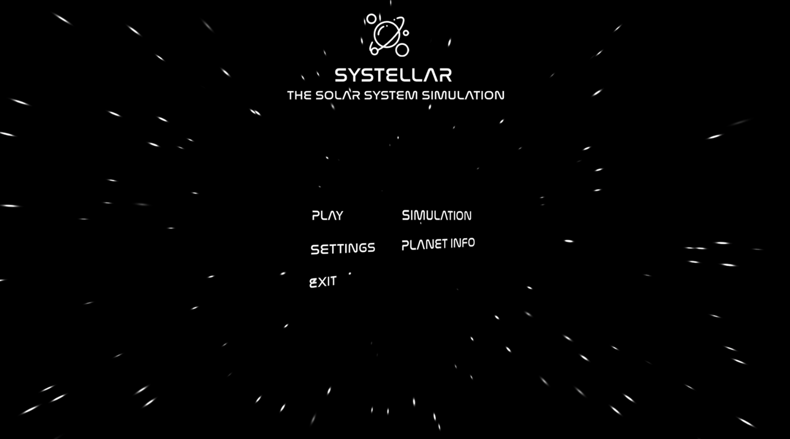
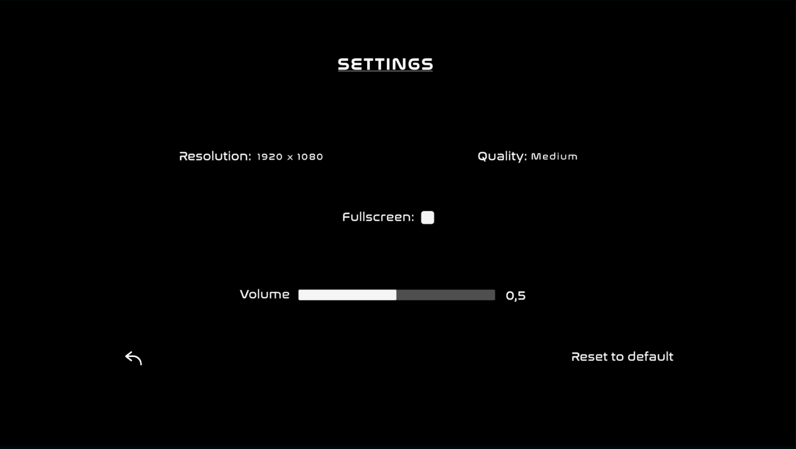
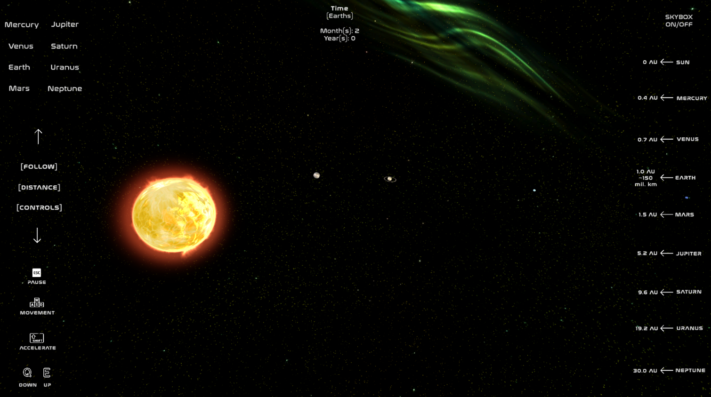
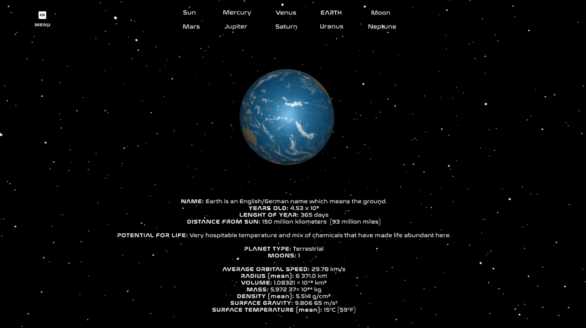

# Systellar
**Solar System simulation and planet info made in _Unity3D_ and _C#_ for educational purposes.**

## Functions 
* Movement for exploring (W -> Forward, S -> Backwords, A-> Left, D -> Right, E -> Up, Q -> Down, Left shift -> Acceleration, Right mouse click -> camera movement)
* Follow option for every planet
* Distances from the Sun (in AU)
* Time (months and years) in Earths time (for better simulation feeling)
* Skybox (ON/OFF)

## Requirements 
* Unity ([Download](https://unity.com/download))
* Script editor of your choice

## Get it running
1. Set up Unity
2. Clone this repository `git clone https://github.com/Topesa/Systellar`
3. Open project with Unity

## Application building
1. File -> Build Settings -> Select target platform and architecture -> Build
2. Have fun 

## Builded application 
* Google Drive ([Dowload](https://drive.google.com/file/d/1VFlidqDUOhq4_DscXSCWoLBh5VI6ewso/view?usp=sharing))

## Screenshots
### Main Menu 

### Settings

### Simulation

### Planet Info

